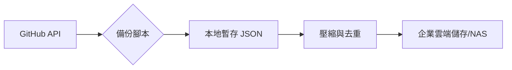

# GitHub Audit Logs 自動化備份指南

為滿足法規對於日誌保留（通常為 180 天）的要求，必須建立自動化備份機制，將 GitHub Enterprise 的 Audit Logs 定期拉取並儲存於企業內部的安全空間。

## 1. 自動化腳本設計邏輯

備份腳本需具備以下核心能力：

1.  **增量拉取 (Incremental Fetch)**：紀錄上次拉取的 `last_cursor` 或時間戳，避免重複拉取大量重複數據。
2.  **去重處理 (Deduplication)**：根據 `_document_id` 進行過濾。
3.  **壓縮與加密**：使用 Gzip 壓縮 JSON 檔案以節省空間。
4.  **自動上傳**：支援 S3 協議、NAS 或內部日誌伺服器（如 ELK/Splunk）。

## 2. 備份流程圖



## 3. 設定與部署

### A. 必要權限
- GitHub Personal Access Token (PAT) 具備 `admin:enterprise` 或 `read:audit_log` 權限。

### B. 排程執行
建議使用 Linux `crontab` 或 GitHub Actions (對外連線需透過 Runner)：
```bash
# 每天凌晨 2 點執行備份
0 2 * * * /usr/bin/python3 /path/to/audit_log_backup.py
```

## 4. 合規性驗證

- **保留期**: 確保腳本成功執行且儲存空間足夠存放至少 180 天的數據。
- **完整性**: 定期檢查日誌檔案的 Hash 值，防止竄改。
