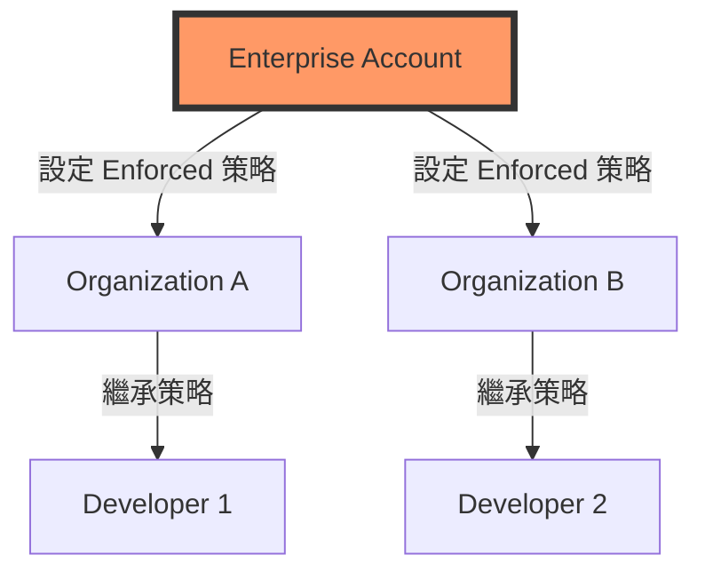
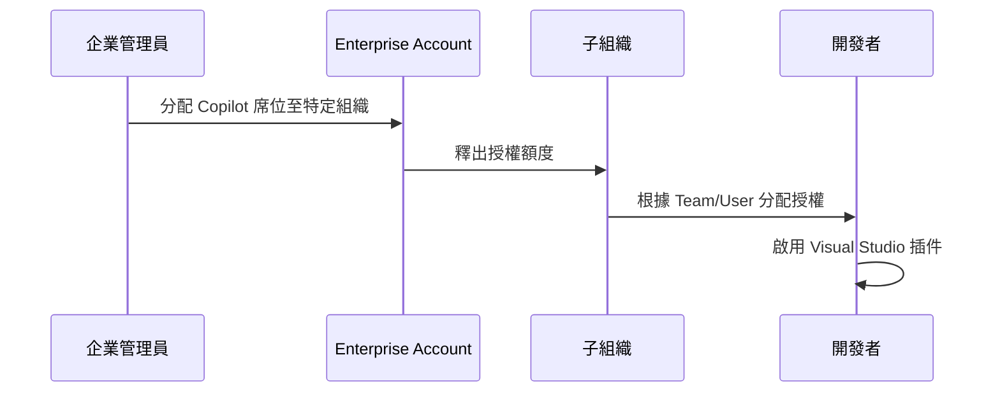

# GitHub Enterprise 全域策略管理指南 (Global Policy Management)

針對大型企業（如產險金控），管理員需從 **Enterprise Account** 層級進行全域控管，而非僅限於個別組織（Organization）。這能確保所有子部門均符合統一的資安與合規標準。

## 1. 企業權限階層架構 (Hierarchy)

在 GitHub 中，策略的繼承邏輯如下：

---

## 2. 進入企業帳戶管理後台
1. 登入 GitHub，點擊右上角個人頭像，選擇 **Your enterprises**。
2. 進入對應的企業帳戶後，點擊左側選單的 **Settings**。
3. 在選單中找到 **GitHub Copilot**。

---

## 3. 全域策略設定重點

### A. 策略強制執行 (Policy Enforcement)
在 Enterprise 層級，管理員可以選擇策略的「執行強度」：
- **No policy**：交由各 Organization 自行決定。
- **Enforced**：所有下屬 Organization 必須遵守，且**不可更改**。
- **Allowed**：各 Organization 可以選擇開啟或關閉。

### B. 關鍵全域開關 (Global Switches)
| 策略項目 | 建議設定 | 說明 |
| :--- | :--- | :--- |
| **Suggestions matching public code** | **Enforced: Blocked** | 強制所有開發者阻斷與公共代碼重複的內容。 |
| **Copilot Chat** | **Enforced: Enabled** | 全域啟動聊天功能，協助開發者進行代碼重構與安全檢查。 |
| **Custom Models** | **Restricted** | 僅允許使用經過企業資安審核的模型版本。 |

---

## 4. 席位與稽核管理 (Seat & Audit Management)

### 席位分配流程 (Provisioning Flow)

### 稽核日誌 (Audit Logs) 監控
管理員應重點監控以下 Event：
- `copilot.enabled`：追蹤哪些組織啟用了服務。
- `copilot.seat_assigned`：稽核授權分配情況，避免資源浪費。
- `copilot.seat_unassigned`：離職或調職人員的權限回收紀錄。

---

## 5. 管理員檢查清單 (Admin Checklist)
1. [ ] 確認企業層級已開啟 **Enterprise Billing**。
2. [ ] 設定 **Single Sign-On (SSO)** 以同步 AD 用戶權限。
3. [ ] 至少每個月執行一次 **Seat Usage Report** 導出，優化授權成本。
4. [ ] 檢查 **IP Allow List**，確保 Copilot 流量不被企業防火牆誤攔。
