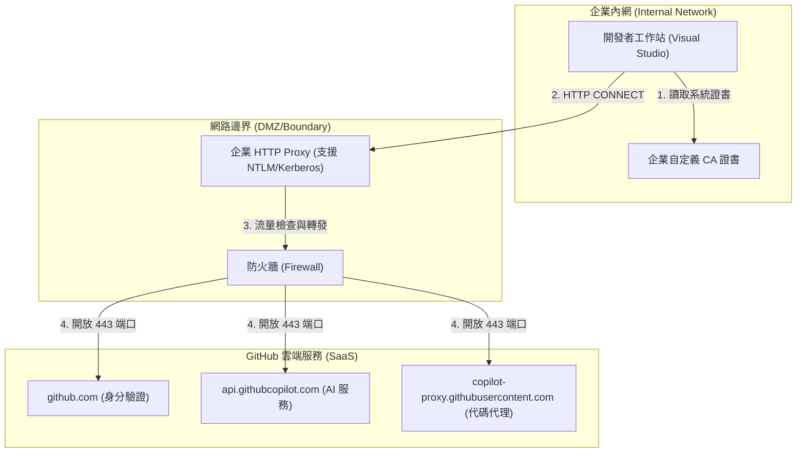
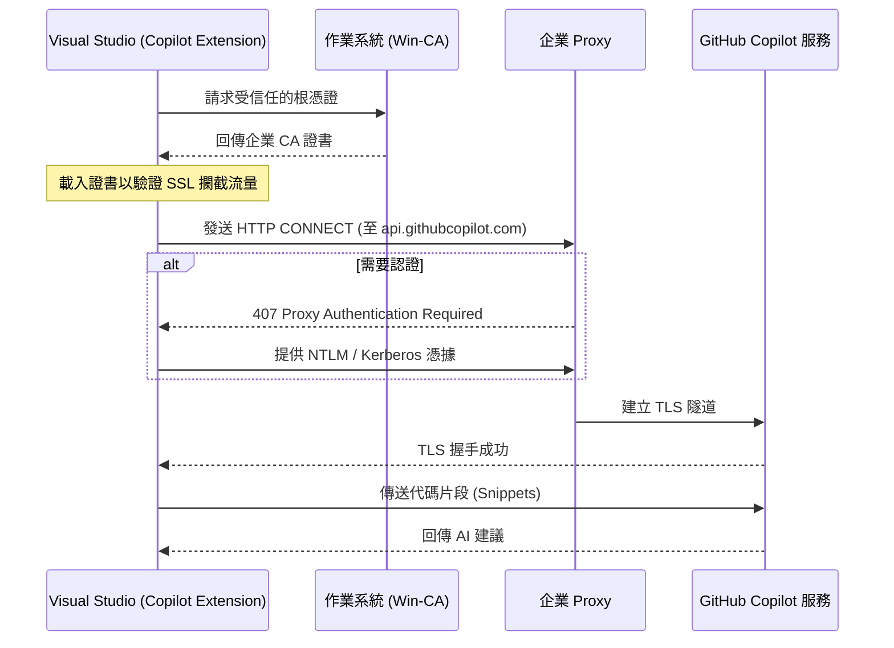
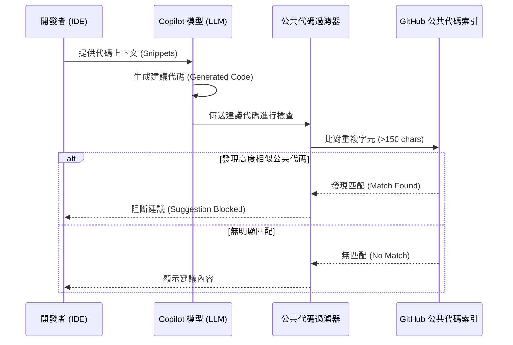

# 企業導入資安研究：網路配置與授權合規

## 🌐 網路代理配置 (Network Proxy Configuration)

### 1. 企業網路整合架構圖 (Network Architecture)



### 2. 代理伺服器連線循序圖 (Connection Sequence)



### 3. 支援的代理協議

- **HTTP Proxy**：GitHub Copilot 支援標準 HTTP 代理。
- **不支援 HTTPS Proxy**：若代理伺服器網址以 `https://` 開頭，目前 GitHub Copilot **不支援**。

### 2. 身份驗證方式
- **基本驗證 (Basic Auth)**：支援使用者名稱與密碼。
- **Kerberos 驗證**：支援企業級 Kerberos 認證。需確保機器擁有有效的 Kerberos Ticket。

### 3. 自定義證書與 SSL 檢查 (Custom Certificates & SSL Inspection)
- **問題**：許多企業代理會進行 SSL 攔截 (SSL Interception)，導致「無法驗證憑證 (unable to verify the first certificate)」錯誤。
- **解決方案**：
    - 將企業自定義 CA 證書安裝至作業系統的信任根憑證授權單位 (Trust Store)。
    - Windows 環境下，Copilot 透過 `win-ca` 套件讀取系統證書。
    - **不建議** 開啟「忽略憑證錯誤 (Ignore SSL errors)」，因為這會產生中間人攻擊 (MITM) 風險。

### 4. 關鍵端點白名單 (Allowlist)
若企業防火牆有嚴格限制，必須開放以下網址：
- `https://github.com` (身份驗證)
- `https://api.github.com` (API 存取)
- `https://copilot-proxy.githubusercontent.com` (代碼補全代理)
- `https://api.githubcopilot.com` (Copilot Chat 服務)

---

## ⚖️ 授權合規檢查 (License & IP Compliance)
導入 AI 輔助開發時，法律與智慧財產權合規是企業最關注的項目。

### 1. 公共代碼過濾循序圖 (Public Code Matching Flow)



### 2. 公共代碼過濾機制 (Public Code Filter)

- **功能**：當 Copilot 產出的代碼片段與 GitHub 上的公共代碼有超過 150 個字元的重複時，系統會自動阻斷該建議。
- **合規建議**：企業應在組織設定中強制將此項設定為 **Block**。

### 2. 開源授權傳染風險 (Copyleft Risks)
- **風險**：產出的片段若與 GPL 等授權代碼高度相似，可能導致企業私有代碼被要求開源。
- **緩解措施**：
    - 啟用上述的公共代碼過濾。
    - 在 CI/CD 流程中加入 **FOSS (Free and Open Source Software) 掃描工具** (如 Black Duck, Snyk)，對 AI 生成的代碼進行二次掃描。

### 3. 智慧財產權歸屬
- **GitHub 條款**：根據 GitHub Copilot 條款，GitHub 不對產出的內容主張版權，內容所有權歸屬於使用者/企業。
- **免責聲明**：使用者仍須對產出代碼的安全性與合規性負最終責任。

---

## 🛠️ 技術診斷工具
若連線失敗，可於 Visual Studio 命令提示字元執行：
```bash
# 測試連線
curl --verbose https://copilot-proxy.githubusercontent.com/_ping

# 測試代理連線
curl --verbose -x http://YOUR-PROXY:PORT https://copilot-proxy.githubusercontent.com/_ping
```
