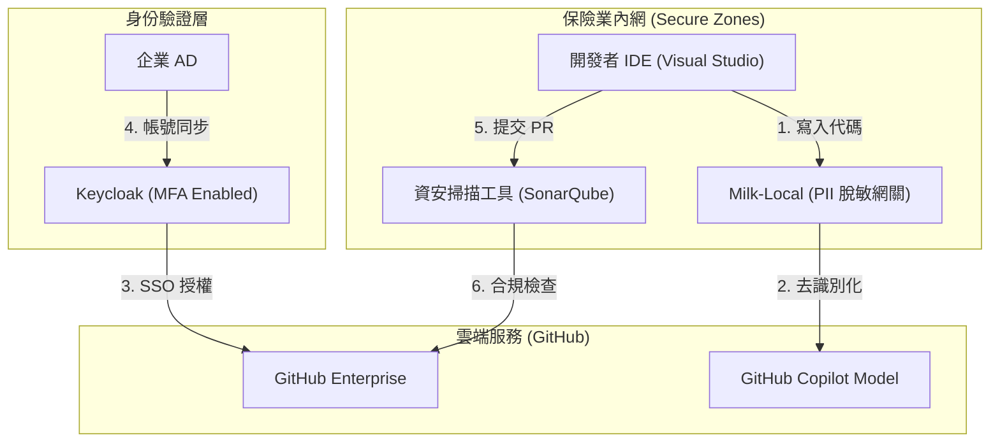

# 保險業資安自律規範與 GitHub Copilot 導入合規研究

## 1. 前言
本研究針對《保險業辦理資訊安全防護自律規範》（以下簡稱「自律規範」）進行條文分析，探討保險業在導入 GitHub Copilot 輔助開發時，應如何調整架構與管理流程以符合法規要求。

## 2. 核心條文分析與導入注意事項

### A. 雲端服務與資產管理 (自律規範第 2, 4 條)
*   **法規要求**：需識別資訊資產（軟體、資料、人員），並對雲端服務進行風險評估。
*   **Copilot 注意事項**：
    *   **資產清冊**：應將 GitHub Copilot 帳號與其產出的代碼納入資訊資產清冊管理。
    *   **雲端風險**：必須確認 Copilot for Business/Enterprise 合約中關於「資料不落地」與「不訓練模型」的條款，作為雲端服務風險評估的依據。

### B. 帳號與存取權限控管 (自律規範第 5 條)
*   **法規要求**：採「一人一號」管理，最高權限帳號應採 **雙因子認證 (MFA)**，人員異動時需即時註銷權限。
*   **Copilot 注意事項**：
    *   **SSO 整合**：必須透過 **GitHub Enterprise + Keycloak/AD** 實施 SSO，確保員工離職時，Copilot 權限與 AD 帳號同步註銷。
    *   **強制 MFA**：GitHub 組織層級應設定強制啟動 MFA。

### C. 程式碼掃描與變更管理 (自律規範第 6, 14 條)
*   **法規要求**：核心系統異動前需進行程式碼掃描 (SAST) 或黑箱測試。
*   **Copilot 注意事項**：
    *   **AI 代碼審核**：AI 生成的代碼片段**不可直接上線**。必須納入現有的變更管理程序，通過靜態分析工具（如 CodeQL, SonarQube）掃描。
    *   **標註來源**：建議在 Git Commit 中標註哪些片段由 AI 協助生成，以利後續稽核。

### D. 個人資料保護與脫敏 (自律規範第 11, 16 條)
*   **法規要求**：辦理遠端作業或使用雲端服務若涉及客戶個資，需具備個人資料安全防護措施。
*   **Copilot 注意事項**：
    *   **PII 屏蔽**：嚴禁將包含保戶真實姓名、身分證字號、保單號碼的代碼片段或註解發送至 Copilot。
    *   **本地清洗層**：應實作 **Milk-Local** 模式，在 IDE 端發送請求前自動過濾敏感資訊。

### E. 稽核軌跡與日誌保留 (自律規範第 16 條)
*   **法規要求**：系統日誌應至少保留 **180 天**，且需確保完整性。
*   **Copilot 注意事項**：
    *   **Audit Logs**：應定期導出 GitHub Enterprise 的 Audit Logs 並備份至企業內部的日誌伺服器 (如 Logstash/Elasticsearch)。
    *   **監控告警**：針對大量 Seat 分配或異常的 IP 存取設定告警。

---

## 3. 合規導入架構建議

## 4. 研究結論
保險業導入 GitHub Copilot 的關鍵不在於禁用，而在於 **「強化中介層」**。透過 Keycloak 滿足帳號管理的自律要求，透過 Milk-Local 滿足 PII 防護的法遵要求，並將 AI 生成內容納入現有的 SAST 流程，即可在合規前提下享受 AI 帶來的開發紅利。
